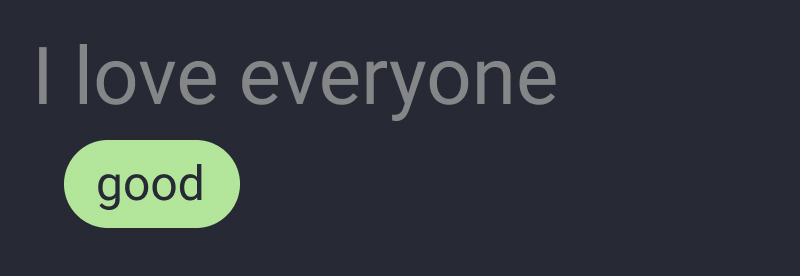
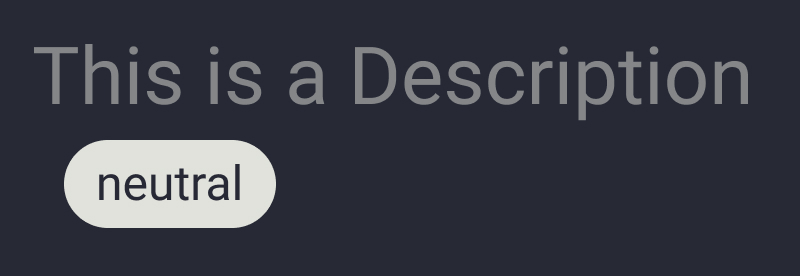
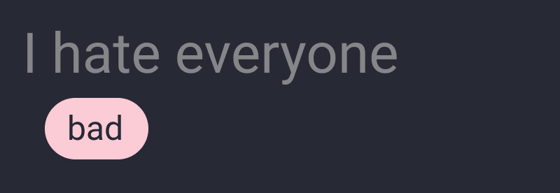

# Santa's Secret

Santa's Secret is a WebApp designed to facilitate Secret Santa gift exchanges among friends and family. It automates the process of assigning participants and enables anonymous communication between the gift giver (Santa) and recipient.

## Features

-   Automatic assignment of participants for Secret Santa.
-   Anonymous text-based communication between Santa and recipient.
-   User registration and login functionality.
-   User profile management.
-   Search functionality for users and games.
-   Game creation, editing, and deletion.
-   Chat functionality within active games.
-   Game stages: waiting for members, running with open chats, and conclusion overview.
-   Sentiment Analysis added to game description
    -   
    -   
    -   

## Technologies Used

-   Node.js server built on the Router, Controller, Model, and View (RCMV) principle.
-   EJS view renderer for generating dynamic HTML pages.
-   MySQL database for storing application data.
-   XAMPP for hosting the MySQL database.
-   npm package manager for installing dependencies.

## Setup Instructions

1. Clone the repository from GitHub.
2. Navigate to the root folder and run the following commands:

```
npm install
node app.js
```

3. The server will start running on port 8080 by default. If port 8080 is not available, modify the port in the `app.js` file.
4. Ensure that your server is connected to the MySQL database. Configure the database credentials in the file `/services/database.js`.
5. Import the database tables using the file located at `/database/santas_secret.sql`.
6. Once the server is running and connected to the database, you will see the confirmation message in the console.

## Usage

-   Access the WebApp by navigating to `http://localhost:8080` in your web browser.
-   Register or login to your account.
-   Explore the various features of Santa's Secret, such as creating and joining games, managing your profile, and engaging in anonymous chats.
-   Refer to the website's home page for an overview of active games and their respective stages.

## Contributions

Contributions to Santa's Secret are valuable and welcome. The project has benefited from the suggestions and feedback of friends and fellow students. Special thanks go to Gabriel Mermer and Veronika Frei, whose insights and feedback have led to the inclusion of certain features and improvements to the overall design.

If you would like to contribute to the project, please follow these guidelines:

1.  Fork the repository and create a new branch for your contributions.
2.  Make your changes and enhancements to the codebase.
3.  Ensure that your code follows the project's coding style and conventions.
4.  Write clear commit messages that describe the purpose of your changes.
5.  Submit a pull request, explaining the changes you have made and their benefits.
6.  Your contributions will be reviewed and considered for inclusion in the main project. Thank you for your interest in improving Santa's Secret!

Feel free to modify this section to include any additional information or guidelines specific to your project's contribution process.
